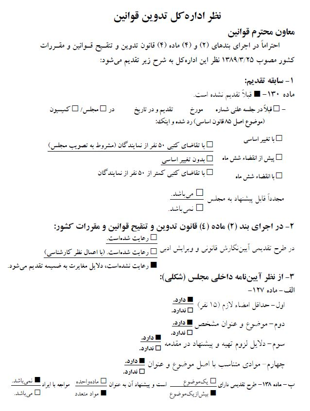
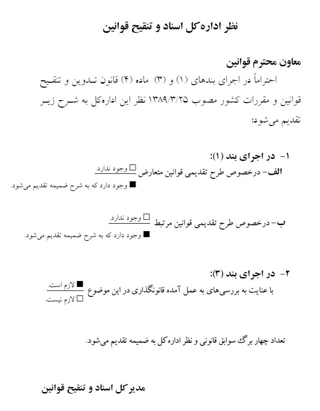

دوره دهم سال سوم  
تاریخ چاپ ١٣٩٧/٩/١١ 
شماره چاپ ١١٨٤ 
شماره ثبت ٤٩٦  

یک‌شوری  

طرح ساماندهی پیام‌رسان‌های اجتماعی  
 
کمیسیون‌های ارجاعی  
اصلی: فرهنگی 
فرعی: اجتماعی- اقتصادی- امنیت ملی و سیاست خارجی- صنایع و معادن- قضائی و حقوقی 

متن‌سوابق به‌دلیل حجم زیاد، به‌صورت جداگانه چاپ می‌شود.  

معاونت قوانین  

ریاست محترم مجلس شورای اسلامی 
احتراماً طرح ذیل که به امضای ٩٥ نفر از نمایندگان رسیده است، جهت طی مراحل قانونی تقدیم می‌شود. 
 
مقدمه (دلایل توجیهی): 
شبکه‌های اجتماعی نقش مؤثری در تثبیت هویت ملی و فرهنگی هر جامعه داشته و امروزه پیام‌رسان‌های اجتماعی به‌عنوان مرجع اثرگذار تعاملات روزمره در حوزه‌های گوناگون فرهنگی، اقتصادی، سیاسی و... شناخته شده و سهم فراوانی در شکل‌گیری مناسبات مختلف در جامعه دارد؛ بر این مبنا نمی‌توان نسبت به ابعاد، آثار و آسیب‌های آن بی‌تفاوت بود.  
 لذا ساماندهی از مرحله شکل‌گیری تا نظارت بر روند فعالیت‌ها و ایجاد ضمانتاجراءها، نیاز به سازوکارهای قانونی داشته که البته نباید فارغ از نگاه‌های حمایتی نسبت به ظرفیت‌های داخلی در عرصه تبادل اطلاعات باشد. سازوکار قانونی حمایت از پیام‌رسان‌های اجتماعی باید با هدف اعتمادسازی و صیانت از حقوق شهروندی، حریم خصوصی، فرهنگ عمومی و امنیت ملی باشد. بر همین اساس طرح ساماندهی پیام‌رسان‌های اجتماعی به‌شرح ذیل تقدیم می‌گردد:  
پژمان‌فر- زرآبادی- یوسف‌نژاد- گلمرادی- سیده‌فاطمه ذوالقدر- ملکشاهی‌راد- نیازآذری- محمداسماعیل سعیدی- امیرحسنخانی- شیویاری- محمدیان- فرهنگی- نانواکناری- نقوی‌حسینی- ترکی- حسینعلی شهریاری- سالک‌کاشانی- محمودی‌شاه‌نشین- قاضی‌پور- موسوی‌لارگانی- کوهکن- نوروزی- بهمنی- مفتح- بت‌کلیا- چنارانی- خالقی- زاهدی- عباسی- لاهوتی- کولیوند- کاتب- محمد عزیزی- 

٢ 

محمدابراهیم رضایی- سیداحسان قاضی‌زاده‌هاشمی- ملکشاهی- جعفرزاده‌ایمن‌آبادی- بابایی‌صالح- ادیانی- ابطحی- سلیمانی- ساری- اصغر سلیمی- شیران‌خراسانی- هزارجریبی- پورحسین‌شقلان- بروجردی- علیرضا ابراهیمی- سامری- الماسی- جمالی‌نوبندگانی- خسته‌بند- جعفرپور- زارعی- آزادی‌خواه- ساعدی- محجوب- فولادگر- امیرآبادی‌فراهانی- سیدامیرحسین قاضی‌زاده‌هاشمی- حاجی‌دلیگانی- احمدی‌لاشکی- اعزازی‌ملکی- ظاهری‌عبده‌وند- بیگلری- منصور مرادی- حمزه- شرفی- نیکفرلیالستانی- ساداتی‌نژاد- فلاحتی- همایون هاشمی- کرد- اسمعیلی- شریعت‌نژاد- رضیان- پورمختار- حسینی‌شاهرودی- بدری- حسینی‌کیا- علیرضا سلیمی- پوربافرانی- کبیری- کوچکی‌نژادارم‌ساداتی- مختار- مسعودی- شکری- مقصودی- وقفچی- برزگر کلشانی- اسدی‌کرم- کرم‌پورحقیقی- کعبی- کریمی‌قدوسی- بیمقدار 

٣ 

### عنوان‌طرح:  
### ساماندهی پیام‌رسان‌های اجتماعی
 
تعریف اصطلاحات:  
ماده١- اصطلاحات به‌کاررفته در این قانون به‌شرح ذیل تعریف می‌شوند:  
الف- پیام‌رسان اجتماعی: سامانه‌های کاربرمحور فراهم‌کننده بستر تعاملات، جمع‌آوری، نمایش، پردازش و انتشار اطلاعات اجتماعی برای برقراری ارتباطات فردی و گروهی و خدمات برخط مانند ارائه خدمات 
پرداخت ازطریق تبادل انواع محتواهای چندرسانه‌ای و حامل‌های داده است.  
ب- پیام‌رسان داخلی: پیام‌رسانی که بیش از پنجاه درصد (٥٠%) سهام آن متعلق به شخص ایرانی بوده و میزبانی آن صرفاً در داخل کشور انجام شده و فعالیت آن در چهارچوب قوانین و مقررات جمهوری اسلامی ایران است.  
پ- صیانت از داده: محافظت از اطلاعات کاربران و جلوگیری از هرگونه افشاء، بهره‌برداری و دسترسی غیرمجاز به اطلاعات مربوط به کاربران و محتوای آثار دیداری، شنیداری، نوشتاری یا ترکیبی از آنها در پیام‌رسان‌های اجتماعی و داده‌های ایجاد یا افزوده‌شده در اثر فعالیت‌ها و تعاملات کاربران آن در پیام‌رسان‌های اجتماعی  
ت- هیأت ساماندهی و نظارت: هیأت ساماندهی، نظارت و تأیید فعالیت، محتوا، عملکرد و تشخیص تخلف و اعلام جرم پیام‌رسان‌های موضوع این قانون 

٤ 

فصل اول: شرایط متقاضی و تأیید فعالیت  
ماده٢- عرضه و ارائه خدمات پیام‌رسان‌های اجتماعی داخلی و خارجی در کشور مستلزم ثبت در پنجره واحد و رعایت قوانین کشور است. فعالیت پیام‌رسان‌های خارجی و داخلی اثرگذار مشروط به تأیید هیأت نظارت خواهد بود. در غیر این صورت فعالیت آنها در کشور غیرقانونی است.  
ماده٣- هیأت نظارت با هدف اعمال حاکمیت جمهوری اسلامی ایران با ترکیب ذیل تشکیل می‌شود:  
١- رئیس مرکز ملی فضای مجازی (به‌عنوان رئیس هیأت)  
٢- معاون ذی‌ربط یا نماینده تام‌الاختیار وزارت ارتباطات و فناوری اطلاعات  
٣- معاون ذی‌ربط یا نماینده تام‌الاختیار وزارت فرهنگ و ارشاد اسلامی  
٤- معاون ذی‌ربط یا نماینده تام‌الاختیار وزارت اطلاعات  
٥- معاون ذی‌ربط یا نماینده تام‌الاختیار دادستانی کل کشور  
٦- یک نماینده از کمیسیون فرهنگی مجلس شورای اسلامی  
٧- صدا و سیمای جمهوری اسلامی ایران  
٨- سپاه پاسداران انقلاب اسلامی  
٩- سازمان تبلیغات اسلامی  
١٠- نیروی انتظامی جمهوری اسلامی  
١١- سازمان پدافند غیرعامل  
١٢- یک نماینده از مدیران پیام‌رسان‌های داخلی  
١٣- نماینده حوزه علمیه  
ماده٤- هیأت ساماندهی و نظارت موظف به نظارت بر پیام‌رسان‌های داخلی و خارجی و تصمیم‌گیری درباره ادامه فعالیت آنها بر اساس مصوبات

٥ 

شورای عالی فضای مجازی است و ضمن رسیدگی به تخلفات، در صورت وقوع جرم، موارد را به قوه قضائیه جهت اقدام مقتضی ارجاع خواهد داد.  
ماده٥- دبیرخانه هیأت نظارت در محل مرکز ملی مستقر خواهد شد و مسؤولیت برگزاری جلسات، ابلاغ و پیگیری مصوبات و نظارت بر حسن اجرای آن را برعهده خواهد داشت.  
ماده٦- هیأت نظارت موظف است پیام‌رسان اثرگذار را براساس معیارهایی از قبیل زیر تعیین کند: تعداد کاربران ثبت‌نامی، تعداد کاربران فعال ماهیانه، هفتگی، روزانه، میزان رشد عضویت کاربران در پیام‌رسان، پراکندگی کشوری، نوع خدمت و حجم ترافیک ایجادشده.  
ماده٧- هیأت نظارت موظف است جهت بررسی صلاحیت متقاضی از مراجع ذی‌صلاح استعلام نماید. مراجع مذکور موظفند حداکثر تا یک‌ماه نظر خود را به هیأت نظارت اعلام نمایند. در مواردی که مرجع ذی‌ربط نیازمند بررسی بیشتر است، زمان تا سه‌ماه قابل تمدید است.  
ماده٨- تصمیمات هیأت نظارت قطعی است. این امر مانع اقامه دعوای افراد ذی‌نفع در مراجع ذی‌صلاح قضائی نخواهد بود.  
ماده٩- تمام پیام‌رسان‌های داخلی و خارجی فعال موظفند حداکثر تا دوماه پس از تصویب این قانون شرایط خود را با آن تطبیق دهند.  
ماده١٠- شرایط متقاضیان ایجاد و فعالیت پیام‌رسان‌های اثرگذار به تصویب هیأت نظارت رسیده و برای تطبیق با سیاست‌های مصوب شورای عالی فضای مجازی به مرکز ملی ارسال می‌شود.  
 
 
٦ 

فصل دوم: صیانت از حریم داده‌ها  
ماده١١- مرزبانی دیجیتال و دفاع مجازی(سایبری) از کشور و جلوگیری از بهره‌برداری غیرمجاز از داده‌های مجازی در درگاه‌های ورود و خروج پهنای باند کشور، با محوریت ستاد کل نیروهای مسلح، توسط مراجع ذی‌ربط انجام خواهد شد. حدود و ثغور وظایف با پیشنهاد ستاد کل نیروهای مسلح به تصویب فرماندهی معظم کل قوا خواهد رسید.  
ماده١٢- مدیران پیام‌رسان‌های اجتماعی و ارائه‌دهندگان خدمات دسترسی و میزبانی، مکلف به صیانت از داده‌های خصوصی اشخاص اعم از حقیقی وحقوقی هستند. این موضوع رافع مسؤولیت قانونی سایر اشخاص نیست.  
ماده١٣- استفاده نهادها و مؤسسات دولتی و عمومی غیردولتی از پیام‌رسان‌های اجتماعی خارجی برای مکاتبات و ارائه خدمات اداری و اطلاع‌رسانی و تبلیغات داخل کشور ممنوع است.  
ماده١٤- هرگونه درج و انتشار اسناد و داده‌های دارای طبقه‌بندی در پیام‌رسان‌های داخلی و خارجی ممنوع است. 
تبصره- نحوه تعیین و تشخیص محرمانگی داده‌ها حداکثر ظرف مدت سه‌ماه پس از تصویب این قانون، توسط وزارت اطلاعات و با همکاری ستاد کل نیروهای مسلح تهیه و تنظیم شود.  
فصل سوم: حمایت‌ها  
ماده١٥- نسبتی از درآمد حاصل از فروش پهنای باند و ترافیک ایجادشده توسط پیام‌رسان‌های داخلی که توسط ارائه‌کنندگان خدمات دسترسی به کاربران نهائی به فروش می‌رسد، باید به پیام‌رسان ایجادکننده این ترافیک پرداخت گردد. میزان این نسبت و نحوه پرداخت این درآمد

٧ 

براساس آیین‌نامه‌ای خواهد بود که ظرف مدت سه‌ماه پس از تصویب این قانون، به پیشنهاد وزارت ارتباطات و فناوری اطلاعات با همکاری وزارت فرهنگ و ارشاد اسلامی تهیه شده و به تأیید هیأت نظارت خواهد رسید.   
تبصره- بخشی از وجوهی‌که‌پیام‌رسان‌ها از محل فوق دریافت می‌کنند باید طبق آیین‌نامه اجرائی مذکور به‌تولیدکنندگان محتوا پرداخت شود.  
ماده١٦- صندوق حمایت از محتوا و پیام‌رسان‌های داخلی فضای مجازی با هدف تأمین اعتبارات مدیریت تبعات فرهنگی توسعه زیرساخت‌های فضای مجازی و تقویت محتوای فاخر ایرانی- اسلامی ذیل هیأت نظارت تشکیل می‌گردد.  
تبصره- هیأت ساماندهی و نظارت موظف است ضمن انتشار عمومی آیین‌نامه حمایت، هرگونه حمایت از پیام‌رسان‌ها را همراه با مصادیق و نوع حمایت‌ها، همچنین دلایل مربوط به آن به اطلاع عموم برساند.  
ماده١٧- بانک مرکزی موظف است امکان پرداخت برخط را برای کسب و کارهای مبتنی بر پیام‌رسان‌های اجتماعی داخلی اثرگذار فراهم و ضوابط و شرایط مربوطه را ظرف مدت دو ماه با هماهنگی هیأت ساماندهی و نظارت تدوین و ابلاغ نماید.  
تبصره- هرگونه ارائه خدمات پولی و بانکی به کسب و کارهای فعال در پیام‌رسان‌های اجتماعی خارجی ممنوع است.  
ماده١٨- بانک مرکزی موظف است جهت سهولت گردش مالی، کاربردی شدن و کمک به چرخه اقتصادی پیام‌رسان‌های داخلی اثرگذار، مجوز ارائه خدماتی از قبیل پرداخت الکترونیکی (PSP) و ابزارهای پرداخت نوین از قبیل ایجاد کیف پول الکترونیکی را به پیام‌رسان‌های داخلی اعطاء نماید.  

٨ 

ماده١٩- استفاده و عرضه «رمز ارز» توسط پیام‌رسان‌های خارجی در داخل کشور ممنوع بوده و در پیام‌رسان‌های داخلی مستلزم دریافت مجوز از سوی بانک مرکزی جمهوری اسلامی ایران براساس سیاست‌های شورای عالی پول و اعتبار می‌باشد و وزارت ارتباطات و فناوری اطلاعات مکلف است پس از تصویب در کارگروه تعیین مصادیق محتوای مجرمانه، فوراً نسبت به مسدودسازی امکان «رمز ارز» توسط سامانه‌ها و پیام‌رسان‌های خارجی اقدام نماید.  
ماده٢٠- صدا و سیما و رسانه‌های دولتی و عمومی مکلفند امکان تبلیغات پیام‌رسان‌های داخلی را به‌طور عادلانه و غیرانحصاری فراهم کنند. ایجاد هرگونه انحصار در صدا و سیما و رسانه‌های دولتی درخصوص پیام‌رسان‌های داخلی ممنوع است. استفاده از پیام‌رسان‌های خارجی برای ارتباط با مخاطبان و همچنین معرفی آنها ممنوع است.  
ماده٢١- هیأت ساماندهی و نظارت موظف است از هر شکل و نوع انحصار پیام‌رسان داخلی و خارجی در کشور جلوگیری نماید.  
فصل چهارم: مجازات‌ها  
ماده٢٢- اشخاصی که اقدام به ایجاد و راه‌اندازی پیام‌رسان‌های اجتماعی بدون مجوز ثبت نموده و با نقض مسدودسازی ارائه خدمات نمایند و یا موجبات نقض غیرقانونی تدابیر مسدودسازی را فراهم نمایند، به شش‌ماه تا دوسال حبس محکوم می‌شوند.  
ماده٢٣- در صورت تخلف از اجرای ماده (١٥)، مسؤول مربوطه، برای مرتبه اول به سه تا شش‌ماه انفصال از خدمت و در صورت ارتکاب در مرتبه دوم به شش‌ماه تا یک‌سال و در صورت تکرار به انفصال دائم از خدمت دولتی محکوم می‌گردد. 

٩ 

ماده٢٤- فعالیت مؤثر در پیام‌رسان‌های اجتماعی خارجی و داخلی مانند ایجاد کانال و گروه‌ها بدون مجوز ممنوع است. ایجاد یا اداره کانال‌ها و گروه‌هایی که با نقض غیرقانونی تدابیر مسدودسازی صورت می‌گیرد، مستوجب محکومیت حبس یا جزای نقدی درجه هشت خواهد بود.  
تبصره- شرایط فعالیت مؤثر مطابق آیین‌نامه‌ای است که توسط وزارت فرهنگ و ارشاد اسلامی تدوین می‌گردد.  
ماده٢٥- در صورت تخلف دستگاه‌های مربوطه و فراهم نمودن امکان دسترسی به پیام‌رسان‌های خارجی، مرتکبان حسب مورد به مجازات‌های پیش‌بینی‌شده در مواد (٧٤٩) و (٧٥١) فصل جرائم رایانه‌ای از 
کتاب تعزیرات قانون مجازات اسلامی محکوم خواهند شد.  
ماده٢٦- اشخاصی که اقدام به فعالیت و مبادلات مالی و ارائه خدمات پولی و مالی در پیام‌رسان‌های اجتماعی خارجی مجاز و غیرمجاز 
نمایند، علاوه بر ضبط اموال مبادله‌شده، به جزای نقدی معادل سه تا پنج برابر وجه مبادله‌شده و مجازات تعزیری درجه هشت محکوم می‌شوند.  
ماده٢٧- در صورت افشاء و سوءاستفاده از اطلاعات کاربران و فراهم‌سازی امکان این اقدامات در غیر موارد قانونی، به مجازات تعزیری درجه سه محکوم می‌شود.  
ماده٢٨- در صورت هتک حرمت و حیثیت اشخاص در پیام‌رسان‌های اجتماعی، مرتکب یا مرتکبان به حداکثر مجازات مندرج در مواد (٧٤٤) تا (٧٤٦) فصل جرائم رایانه‌ای قانون مجازات اسلامی محکوم می‌شوند.  

١٠ 

### هیأت‌رئیسه محترم مجلس شورای اسلامی 
احتراماً، در اجرای آیین‌نامه داخلی مجلس شورای اسلامی و ماده (٤) قانون تدوین و تنقیح قوانین و مقررات کشور مصوب ١٣٨٩/٣/٢٥ نظر معاونت قوانین در مورد طرح ساماندهی پیام‌رسان‌های اجتماعی تقدیم می‌شود.   
**معاون قوانین**

١١ 

١٢ 

١٣ 

بیان مستندات و دلایل مغایرت:
١- کلیت این طرح به ویژه مواد (٢)، (٣)، (٤)، (٧)، (٨)، (٩)، (١٠)، (١١) و (١٦) آن به جهت موازی کاری، تداخل وظایف و سایر احکام و تکالیف، مغایر موارد ذیل و نتیجتاً مغایر اصل پنجاه و هفتم(٥٧) قانون اساسی می باشد.  
الف- حکم مقام معظم رهبری(مدظله العالی) راجع به تشکیل و انتصاب اعضای شورای عالی فضای مجازی مورخ ١٣٩٠/١٢/١٧ 
‌ب- اساس‌نامه مرکز ملی فضای مجازی کشور که در جلسه مورخ ١٣٩١/٤/٣١ به تصویب شورای عالی فضای مجازی رسیده و در مورخ ١٣٩١/٥/١ به تأیید مقام معظم رهبری(مدظله العالی) رسیده است. 
ج- مصوبه «سیاست ها و اقدامات ساماندهی پیام رسان های اجتماعی» مصوب جلسات شماره ٣٦ مورخ ١٣٩٥/١٠/١١، شماره ٣٧ مورخ ١٣٩٥/١١/٩، شماره ٣٨ مورخ ١٣٩٥/١٢/٧، شماره ٣٩ مورخ ١٣٩٦/١/٢٦ و شماره ٤٠ مورخ ١٣٩٦/٣/١٣ شورای عالی فضای مجازی 
٢- ایجاد تشکیلاتی نظیر هیأت نظارت و دبیرخانه آن در طرح تقدیمی متضمن بار مالی و بدلیل عدم پیش بینی محل تأمین آن مغایر اصل هفتاد و پنجم (٧٥) قانون اساسی است. 
٣- بخش ابتدائی طرح تحت عنوان «اصطلاحات» باید به عنوان فصل اول درج شود. 
٤- واژه «نماینده» در ابتدای بندهای (٧)، (٨)، (٩)، (١٠) و (١١) ماده (٣) باید درج شود. 
٥- برخی از مواد طرح جایگاه مناسبی از جهت ارتباط با فصل‌ها و سایر مواد ندارند و بازنگری کلی در طرح لازم است؛ بطور مثال مواد (٣) تا (٥) طرح که در مقام شرح وظایف و ساختار است ولی ذیل فصل شرایط متقاضی آمده است. 
٦- استفاده از افعال آینده در طرح، از جمله مواد(٤)، (٥)، (٨) و(١١) خلاف اصول نگارش متون قانونی است. 
٧- در مواد(٥) و (١٠) عبارت «مرکز ملی» با توجه به عدم ذکر آن در فصل اختصارات باید به صورت کامل درج گردد: «مرکز ملی فضای مجازی» 
٨- با توجه به اینکه بنا بر دستور رئیس محترم مجلس شورای اسلامی طرحهای مربوط به ستاد کل نیروهای مسلح باید پیش از طرح در مجلس به تصویب این ستاد برسد، لذا درخصوص ماده (١١) و تبصره ماده (١٤) باید تمهیدات لازم به عمل آید. 
٩- مناسب است در ماده (١٣) عبارت «دستگاههای موضوع ماده (٥) قانون مدیریت خدمات

١٤

کشوری و ماده (٢٩) قانون برنامه ششم توسعه» به جای عبارت «نهادها و مؤسسات دولتی و عمومی غیردولتی» ذکر شود. 
١٠- ضمانت اجرای قانونی در مواد (١٢) تا (١٤) پیش بینی نشده است. 
١١- عبارت «بخشی از وجوهی که پیام رسان ها از محل فوق دریافت می کنند» در تبصره ماده(١٧) طرح، به دلیل عدم تعیین میزان آن، مبهم است. 
١٢- در ماده (١٦) طرح: 
الف- درخصوص صندوق حمایت از محتوا و... اعضاء، ساز و کار، نحوه نظارت و وظایف آن مورد ابهام است. 
ب- طبق اصول نگارش متون قانونی فلسفه، هدف و ضرورت باید در مقدمه توجیهی ذکر شود لذا عبارت «با هدف» تا «اسلامی» حذف گردد. 
ج- تبصره مستثنی از اصل ماده نمی باشد، لذا می‌تواند به صورت ماده مستقلی ذکر شود. 
د- در تبصره به جای عبارت «آیین نامه حمایت» باید عبارت «آیین نامه موضوع ماده (١٥) قانون» ذکر شود. 
١٣- با توجه به اینکه مطابق اصول نگارش متون قانون فلسفه، هدف و ضرورت باید در مقدمه توجیهی بیاید لذا عبارت از «جهت» تا «اثرگذار» در ماده (١٨) حذف و به مقدمه منتقل گردد. 
١٤- جهت رفع هرگونه ابهام، لازم است عبارات «رمز ارز» و «کارگروه تعیین مصادیق مجرمانه» مندرج در ماده (١٩) در بخش نخست و در اصطلاحات ذکر شوند. 
١٥- مواد (٢٢) و (٢٣) خلاف بند (١٤) سیاست های کلی قضائی ابلاغی مقام معظم رهبری (١٣٨١/٧/٢٩) مبنی بر کاهش مجازات زندان می‌باشد، همچنین مناسب است ادبیات تقنینی این دو ماده همانند ماده(٢٤) که یکی از درجات مجازات‌های تعزیری مندرج در ماده(١٩) قانون مجازات اسلامی مصوب ١٣٩٢ در آن پیش بینی شده، نگارش شود. 
١٦- در ماده(٢٤) وظیفه تدوین آیین‌نامه برعهده وزارت فرهنگ و ارشاد اسلامی قرار گرفته است جهت رعایت وحدت رویه لازم است که همانند ماده(١٥) تصریح شود که آیین‌نامه مذکور به تأیید هیأت نظارت برسد. 
١٧- در مواد (٢٥) و (٢٨) طرح حاضر به یکی از فصل های کتاب پنجم قانون مجازات اسلامی (تعزیرات) ارجاع داده شده است، علاوه بر آنکه لازم است عنوان قانون به صورت صحیح درج شود، بهتر است همانند مواد (٢٤)، (٢٦) و (٢٧) به قانون مجازات اسلامی مصوب ١٣٩٢ ارجاع شود تا ضمن رعایت یکسان نویسی مشکل موقت بودن قانون مذکور حل شود. 
١٨- در ماده (٢٦) طرح عبارت «مجازات تعزیری درجه هشت» به عبارت «یکی از مجازات های تعزیری درجه هشت» اصلاح گردد.  

١٥ 

١٦ 

## ضمیمه نظر اداره‌کل اسناد و تنقیح قوانین   نظر اداره‌کل به انضمام سوابق قانونی 
 
**الف-  نظر اداره كل  **
١- تشکیل هیات مندرج در ماده ٣ طرح متضمن بارمالی و مغایر اصل٧٥ قانون اساسی است.  
٢- با توجه به اینکه تامین منابع مالی صندوق موضوع ماده ١٦ طرح پیش‌بینی نشده است تشکیل صندوق مزبور متضمن بارمالی و مغایر اصل٧٥ قانون اساسی است.  
٣- فصل چهارم طرح، مبنی بر تعیین مجازات حبس، مغایر با بند (١٤) سیاست های کلی قضایی ابلاغی ١٣٨١/٧/٢٨ مبنی بر کاهش استفاده از مجازات زندان و نیز بند (٦٤) سیاست های کلی برنامه ششم توسعه مصوب ١٣٩٤/٤/٩ است.  
٤- بهتر است در ابتدای طرح عبارت «فصل اول» قبل از عبارت «تعریف اصطلاحات» درج شود.  
٥- تعریف پیام رسان اجتماعی مندرج در بند الف ماده ١ طرح متفاوت با تعریف مذکور در سند سیاست ها و اقدامات ساماندهی پیام رسان های اجتماعی مصوب ١٣/ ٣/ ١٣٩٦ شورای عالی فضای مجازی می باشد.  
٦- با توجه به اینکه درقسمت پایانی سند تشکیل شورای عالی فضای مجازی، اعضای حقیقی و حقوقی آن توسط مصوب مقام معظم رهبری مشخص شده اند و پرداختن به امور مربوط به فضای مجازی کشور را در چارچوب مصوبات شورای عالی فضای مجازی در همه سطوح از جمله وظایف مرکز ملی فضای مجازی کشور تعیین کرده است در حالیکه مطابق ماده ٢ طرح این وظایف بایستی در چهارچوب قوانین کشور تنظیم و عملیاتی شود، بنابراین در چنین شرایطی امکان بروز عدم هماهنگی و تطابق سیاست گذاریها بسیار زیاد است.  
٧- مطابق مواد ٢ و ٤ طرح فعالیت پیام رسانها مشروط به تأیید هیأت نظارت خواهدبود در صورتی که مطابق حکم مقام معظم رهبری در مورد تشکیل شورای عالی فضای مجازی و اساسنامه مرکز ملی فضای مجازی نظارت در همه سطوح با مرکز ملی فضای مجازی خواهدبود.  
٨- بهتر است در بند ٧، ٨، ٩، ١٠ و ١١ ماده ٣ طرح مانند سایر بندها مشخص شود که چه شخصی از طرف این ارگانها قرار است در هیأت مذکور دراین ماده حاضر شود.  
٩- اگر منظور از هیات نظارت مندرج در ماده٣ طرح همان کارگروه مندرج در ماده ٢ مصوبه سیاستها و اقدامات ساماندهی پیام رسانهای اجتماعی می باشد باید اعضای آن دقیقا منطبق بر

١٧

آن ماده تعیین شود در غیر این صورت مغایر با آن می باشد.  
١٠- مطابق اساسنامه مرکز ملی فضای مجازی این مرکز در چهارچوب مصوبات شورای عالی فضای مجازی فعالیت میکند در صورتی که در ماده ٣ طرح این وظایف برای رئیس مرکز ملی فضای مجازی تعیین شده است.  
١١- عنوان هیات نظارت مذکور در ماده ٣ در ماده ٤ درست درج نشده است و تحت عنوان «هیات ساماندهی و نظارت» قید شده است.  
١٢- منظور از «مرکز ملی»مندرج در مواد ٥ و ١٠ طرح مشخص نیست و چنانچه منظور مرکز ملی فضای مجازی می باشد بهتر است عنوان کامل آن درج شود.  
١٣- برای حکم ماده ٩ طرح ضمانت اجرائی پیش بینی نشده است به ویژه مشخص نیست که موظف کردن پیام رسانهای خارجی به اجرای حکم این ماده از چه طریقی ممکن است و آیا اساسا چنین موردی ممکن است یا خیر.  
١٤- برای احکام مواد ١٢، ١٣ و ١٤ طرح ضمانت اجرایی پیش بینی نشده است.  
١٥- به نظر می‌رسد اشخاص موضوع ماده ١٣ طرح جامع نیست و دربردارنده تمام دستگاهها نمی باشد.  
١٦- بهتر است در تبصره ماده ١٤طرح عبارت «می شود» جایگزین «شود» گردد.  
١٧- اصطلاح «ذیل هیات نظارت» مذکور در ماده ١٦ طرح نادرست است، پیشنهاد می شود عبارت«به عنوان زیرمجموعه هیات نظارت» جایگزین آن شود.  
١٨- در تبصره ماده ١٦ طرح لازم است مشخص شود منظور از «آیین نامه حمایت» کدام آیین نامه است.  
١٩- معنی عبارت «رمز ارز» مذکور در ماده ١٩ طرح مشخص نیست، پیشنهاد می شود دربخش مربوط به اصطلاحات تعریف شود.  
٢٠- به طور کلی وظایف مندرج در مواد ٩، ١١،١٠ و سایر مواد این طرح باوظایف تعیین شده ازسوی شورای عالی فضای مجازی برای مرکز ملی فضای مجازی تداخل داشته و در بسیاری موارد مغایر آن وظایف می باشد.  
٢١- ماده (٢٢) طرح برای ارتکاب «معاونت در جرم» و «جرم اصلی»، مجازات یکسان در نظر گرفته است که برخلاف " اصل تناسب جرم و مجازات" است.  
٢٢- در صدر ماده (٢٢) طرح به جهت رعایت اصول نگارش قانون، «هر شخصی» جایگزین گردد.  
٢٣- در ماده (٢٢) طرح به جهت رعایت وحدت رویه، عبارت «حبس درجه شش» جایگزین «شش ماه تا دوسال حبس» گردد.  

١٨

٢٤- مواد طرح(از جمله مواد ٢٣،٢٤،٢٥،٢٧ و ٢٨)، به ویژه در فصل چهارم فاقد شیوه نگارش قانونی است و افعال به صورت مجهول به کار رفته اند و درست آن است که فاعل یا مرتکب جرم در ابتدای مواد درج شود.  
٢٥- ماده (٢٣) طرح، مبنی بر تخلف از ماده (١٥) می تواند در قالب یک تبصره به ماده (١٥) طرح الحاق شود.  
٢٦- در ماده (٢٣) طرح، بعد از عبارت ماده (١٥)، «این قانون» اضافه گردد.  
٢٧- پیشنهاد می گردد شرایط فعالیت موثر که در تبصره ماده به موجب آیین نامه قرار است تدوین گردد به تایید هیات نظارت برسد.  
٢٨- مصادیق فعالیت موثر موضوع ماده (٢٤) طرح باید به صورت دقیق احصا گردد درحالیکه در ماده (٢٤) به صورت تمثیلی بیان شده است.  
٢٩- در ماده (٢٦) طرح، باید پیام رسان های اجتماعی خارجی مجاز و غیر مجاز به صورت دقیق در ماده (١) طرح، تعریف شوند و معیار تشخیص آن تعیین گردد.  
٣٠- در قسمت اخیر ماده (٢٦) طرح، عبارت یکی از مجازاتهای تعزیری درجه هشت جایگزین گردد.  
٣١- در مورد مجازات تعزیری درجه هشت مندرج در ماده (٢٦) طرح، لازم به ذکر است که به موجب ماده (٦٥) و (٦٨) قانون مجازات اسلامی، کلیه حبس های تعزیری درجه هشت به مجازاتهای جایگزین حبس تبدیل می شوند.  
٣٢- ماده (٢٧) طرح، برای ارتکاب «معاونت در جرم» و «جرم اصلی»، مجازات یکسان در نظر گرفته است که برخلاف " اصل تناسب جرم و مجازات" است.  
٣٣- ماده (٢٧) طرح، با مواد (٧٢٩)، (٧٣٠) و(٧٣١) قانون مجازات اسلامی (فصل جرایم رایانه ای) مربوط به دسترسی غیر مجاز به داده هایی که به وسیله تدابیر امنیتی حفاظت شده است، شنود غیرمجاز و دسترسی یا افشای داده های سری همپوشانی پیدا می کند و از حیث میزان مجازات حبس متفاوت است.  
٣٤- موارد قانونی مندرج در ماده (٣٢) طرح، باید به صورت دقیق و با ذکر عنوان قانون تصریح شود.  
٣٥- ماده(٢٨) طرح، با مواد(٧٤٤) تا (٧٤٦) قانون مجازات اسلامی (فصل جرائم رایانه ای) مربوط به هتک حیثیت و نشر اکاذیب همپوشانی دارد و از حیث مجازات متفاوت است و ماده(٢٨) طرح، برخلاف مواد مذکور برای این جرائم حداکثر مجازات را پیش‌بینی نموده است درحالیکه به‌موجب تبصره ماده(٧٤٤) قانون مجازات اسلامی تنها در فرض مستهجن بودن تغییر یا تحریف، مرتکب به حداکثر مجازات محکوم می گردد.  

١٩

**ب- سوابق قانونی**
### جدول سوابق قانونی طرح ساماندهی پیام رسان های اجتماعی

| **مواد** | **تاریخ تصویب** | **عنوان** | **ردیف** |
|:-:|:-:|:-:|:-:|
| ٧٣٠-٧٢٩-١٩-٧٤٦-٧٤٤-٧٣١-٧٥١-٧٤٩ | ١٣٩٢/٢/١ | قانون مجازات اسلامی با اصلاحات و الحاقات بعدی | ١ |
| کل مواد | ١٣٩٦/٣/١٣ | سیاست ها و اقدامات ساماندهی پیام رسان های اجتماعی | ٢ |
| کل مواد | ١٣٩٠/١٢/١٧ | تشکیل شورای عالی فضای مجازی و تعیین اعضای حقیقی و حقوقی آن | ٣ |
| کل مواد | ١٣٩١/٤/٣١ | اساس‌نامه مرکز ملی فضای مجازی کشور شورایعالی فضای مجازی | ٤ |
| کل مواد | ١٣٨٣/٢/١٥ | قانون احترام به آزادی‌های مشروع و حفظ حقوق شهروندی | ٥ |
| کل مواد | ١٣٨٢/١٠/١٧ | قانون تجارت الکترونیکی با اصلاحات و الحاقات بعدی | ٦ |
| کل مواد | ١٣٨٢/٩/١٩ | قانون وظایف و اختیارات وزارت ارتباطات و فناوری اطلاعات | ٧ |

٢٠
